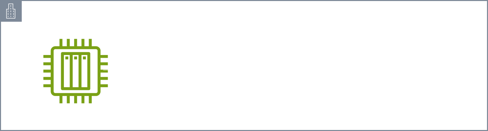
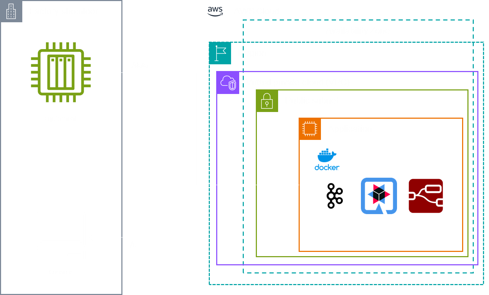

# Introduction

Maintenance Mitra is an application to display machine parameters, detect alarm conditions and duration in near real-time from one machine to one user at a time. The application is launched as a Docker Compose stack.

- [Introduction](#introduction)
  - [On-premise installation](#on-premise-installation)
    - [Pre-requisites](#pre-requisites)
    - [Install instructions](#install-instructions)
  - [EC2 installation](#ec2-installation)
    - [Pre-requisites](#pre-requisites-1)
    - [Install instructions](#install-instructions-1)

This repository documents installation of Maintenance Mitra on two targets - on-premise or AWS EC2.

## On-premise installation

The diagram below shows the topology to install Maintenance Mitra application on the on-premises server.

### Pre-requisites

The pre-requisites for installation are as follows:

1. A 64-bit Windows or a Linux server with minimum 1 core CPU and 4GB RAM to spare.
2. Docker and Docker Compose are pre-installed.
3. Internet connection should be available for the duration of installation (typically, 15 mins).

### Install instructions

See [here](docs/on-premises.md) for install instructions on on-premise machine.

## EC2 installation

The diagram below shows the topology to install Maintenance Mitra application on the on-premises server.

### Pre-requisites

The pre-requisites for installation are as follows:

1. `t3a.medium` instance in public subnet or private subnet with NAT gateway enabled.
2. Following ports should be opened. It is _strongly recommended_ that the source is limited to certain IP addresses than opening to "world".
  1. `22` for `ssh`
  2. `8080` for UI
  3. `8081` for Payload
  4. `8082` for Limits

### Install instructions

See [here](docs/ec2.md) for install instructions on EC2 machine.
