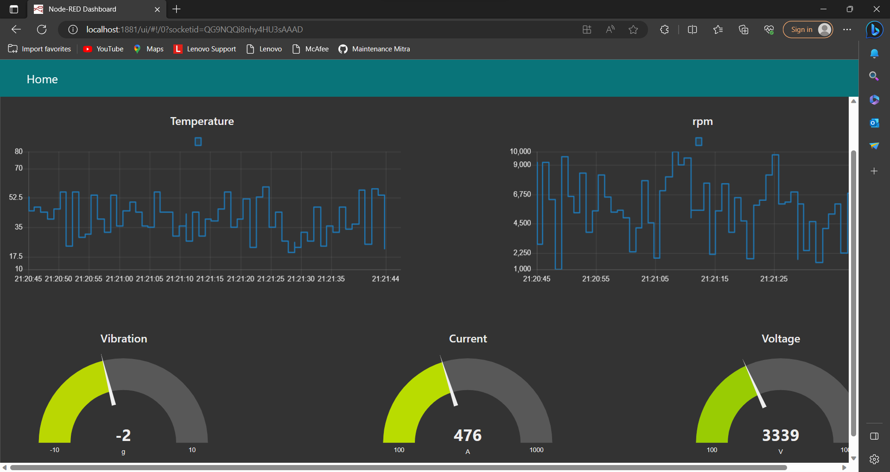

# Introduction

Maintenance Mitra is an application to display machine parameters, detect alarm conditions and duration in near real-time from one machine to one user at a time. The application is launched as a Docker Compose stack.



- [Introduction](#introduction)
  - [Launch](#launch)
    - [Pre-requisites](#pre-requisites)
    - [Topology](#topology)
    - [Quick Start](#quick-start)
    - [Custom launch](#custom-launch)
  - [Upgrade](#upgrade)

## Launch

The Maintenace Mitra application can be launched in the following modes.

1. [Quick Start](#quick-start) - test with sample data using a REST client simulator.
2. [Custom launch](#custom-launch) - configure multiple parameters before launching.

> Both **Quick Start** and **Custom Launch** modes are available for free where, number of invocations are limited upto `3600` requests in a time window of `1 hour` at one go. For unlimited usage, purchase a license as described [here](./docs/license.md). Customisation charges are applicable for customising dashboard for **Custom Launch**.

### Pre-requisites

- Docker should be running with at least 1 core CPU and 2 GiB RAM allocated.

### Topology


In the figure above, the **Server** is a machine that hosts Docker where Maintenance Mitra will run. The **Equipment** will publish data and **Console** will display the dashboard of parameters, alarm conditions and duration in near real-time.

### Quick Start

> The **Quick Start** mode is available for free where, number of invocations are limited upto `3600` requests in a time window of `1 hour` at one go. For unlimited usage, purchase a license as described [here](./docs/license.md).

The following steps brings up the Maintenance Mitra application that is configured with sample limits. The Maintenance Mitra application can be tested with the sample REST client.

1. Clone repository.

```bash
git clone https://github.com/nsubrahm/launcher
cd launcher/launch
```

2. Log into Container registry. Contact us to obtain value of `CR_PAT`.

```bash
echo $CR_PAT | docker login -u chainhead --password-stdin
```

3. Launch application.

```bash
docker compose --env-file launch.env up -d
```

4. Configure the application with sample limits using a CSV file named as `limits.csv` as shown below. These limits are defined for parameters published by REST simulator.

```csv
meta.id=8c3aacea-7bf5-4f91-a767-7ad1083a5958,meta.ts=2023-08-15T00:00:00.000,data.key=rpm,data.lo=1000,data.hi=10000
meta.id=1b9d6bcd-bbfd-4b2d-9b5d-ab8dfbbd4bed,meta.ts=2023-08-15T00:00:00.000,data.key=temperature,data.lo=20,data.hi=60
meta.id=74058447-87a1-4a17-8023-54ad56067ac1,meta.ts=2023-08-15T00:00:00.000,data.key=current,data.lo=100,data.hi=1000
meta.id=74058447-87a1-4a17-8023-54ad56067ac1,meta.ts=2023-08-15T00:00:00.000,data.key=vibration,data.lo=-10,data.hi=10
meta.id=74058447-87a1-4a17-8023-54ad56067ac1,meta.ts=2023-08-15T00:00:00.000,data.key=voltage,data.lo=100,data.hi=1000
```

5. Run the following command to configure limits in bulk.

```bash
curl -X POST http://127.0.0.1:9090/bulk -H "Content-Type: text/plain" --data-file "@limits.csv"
```

6. Publish sample data to `/data` end-point.

```bash
docker run --name simulator-rest -e FREQUENCY=100 -e BASE_URL="http://127.0.0.1:8080" -e API_ENDPOINT="/data" -e TZ="Asia/Kolkata" ghcr.io/nsubrahm/simulator-rest:latest
```

- `FREQUENCY` is the rate, in miliseconds, at which payload is to be published.
- Other environment variables need not be changed when running in Quick Start mode.

To stop simulation, run `docker rm simulator-rest`.

7. Access dashboard.

The default dashboard can be accessed at [`http://localhost:1881/ui`](http://localhost:1881/ui). To configure port numbers for dashboard, see [Dashboard](#dashboard).

8. To shut down the application, navigate to the `launcher/launch` folder and run the following command.

```bash
docker compose down
```

### Custom launch

> The **Custom Launch** mode is available for free where, number of invocations are limited upto `3600` requests in a time window of `1 hour` at one go. For unlimited usage, purchase a license as described [here](./docs/license.md). Customisation charges are applicable for customising dashboard for **Custom Launch**.

There are three sections of customization.

1. [Publish payload](./docs/payload.md).
2. [Configure limits](./docs/limits.md).
3. [Customize dashboard](./docs/dashboard.md).

To shut down the application, navigate to the `launcher/launch` folder and run the following command.

```bash
docker compose down
```

## Upgrade

For unlimited usage, purchase a license as described [here](./docs/license.md).
