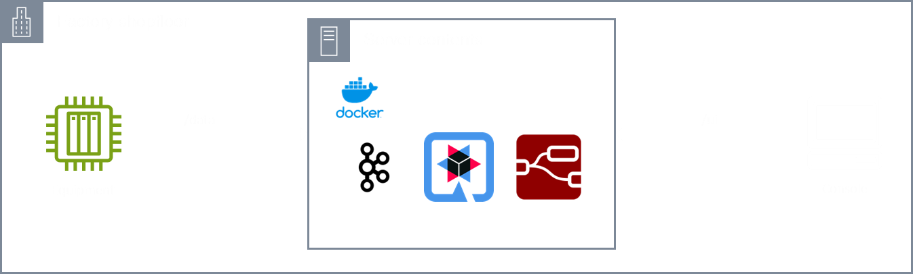

# Introduction

Maintenance Mitra is an application to display machine parameters, detect alert conditions and duration in near real-time from one machine to one user at a time. The application is launched as a Docker Compose stack. This application is available for free with default [license](#license).

Typical use cases include capturing of data from CNC machines with FANUC, Mitsubishi, etc. controllers for discrete manufacturing to monitor the running condition of equipment. Or, MODBUS, OPC UA server, etc. in case of process manufacturing to monitor process efficiency.

- [Introduction](#introduction)
  - [On-premise installation](#on-premise-installation)
    - [Pre-requisites](#pre-requisites)
    - [Install instructions](#install-instructions)
  - [Usage](#usage)
    - [Quick start](#quick-start)
    - [Customization](#customization)
  - [License](#license)

This repository documents installation and usage of Maintenance Mitra on on-premise.

## On-premise installation

The diagram below shows the topology to install Maintenance Mitra application on the on-premises server.

1. Raw data of an equipment can be published as a REST client to the `/data` endpoint.
2. The console accesses the `/ui` endpoint to view the dashboard.
3. The console may access the `/limits` endpoint to browse or set limits of the parameters published by the equipment or REST API client.

### Pre-requisites

The pre-requisites for installation are as follows:

1. A 64-bit Windows or a Linux server with minimum 1 core CPU and 4GB RAM to spare.
2. Docker and Docker Compose are pre-installed.
3. Internet connection should be available for the duration of installation (typically, 15 mins).

### Install instructions

The installation documentation has been reorganized into smaller, more focused documents:

- [Main Installation Guide](docs/main-installation.md) - Overview and quick start
- [Detailed Installation Steps](docs/installation-steps.md) - Step-by-step instructions
- [Configuration Guide](docs/configuration.md) - Configuration options
- [Verification Guide](docs/verification.md) - How to verify installation
- [Troubleshooting Guide](docs/troubleshooting.md) - Common issues and solutions
- [Clean-up Guide](docs/clean-up.md) - How to remove the application
- [Quick Reference](docs/quick-reference.md) - Command cheat sheet

## Usage

Once installed, the application can be used immediately or with customizations.

> In either mode - quick start or customizations - the default license key will apply. See [License](#license) for more details.

### Quick start

1. The application expects raw data at the `http://localhost:80/data` endpoint via a HTTP `POST` call. For details on developing a REST API client application conforming to the payload, see [payload documentation](./docs/payload.md). You can test with a [REST client simulator](https://github.com/nsubrahm/simulators/tree/main/rest).

2. To generate alerts on parameters of the payload, the limits of the parameters should be configured by sending payload to `http://localhost:80/limits`. For details on developing a REST API client conforming to payload, see [limits documentation](./docs/limits.md). If limits are not configured, then no alerts will be generated. However, the application can be still used.

3. Enter `http://localhost:80/ui` in a browser to view the dashboard.

4. To apply a new license, edit `conf/license.key` file with new license key. Contact us for the new license key. 

### Customization

1. Only dashboard customization is supported. Contact us for development of new dashboard. Once the dashboard is customised, rest of the steps are same as the ones for quick start.

## License

By default, this application implements rate-limiting such that, a maximum of `3600` requests can be sent in a time window of `1 hour` - whichever is earlier. For example, if a machine publishes data every second, then the machine can keep publishing continuously upto a maximum of `3600` requests (`1*3600=3600`) for upto `1 hour`. The rate limit is applied even if the number of requests exceed `3600` _within_ the time window of `1 hour`.

To upgrade, contact us for a new license key. Edit `conf/license.env` with the new license key.
